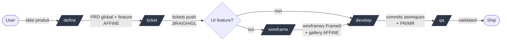
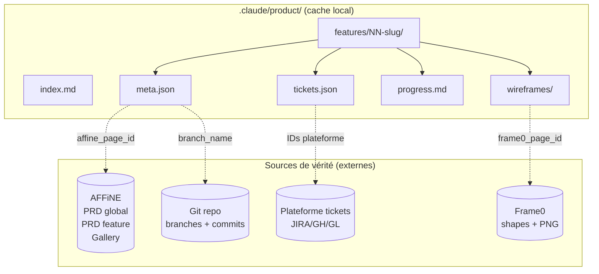
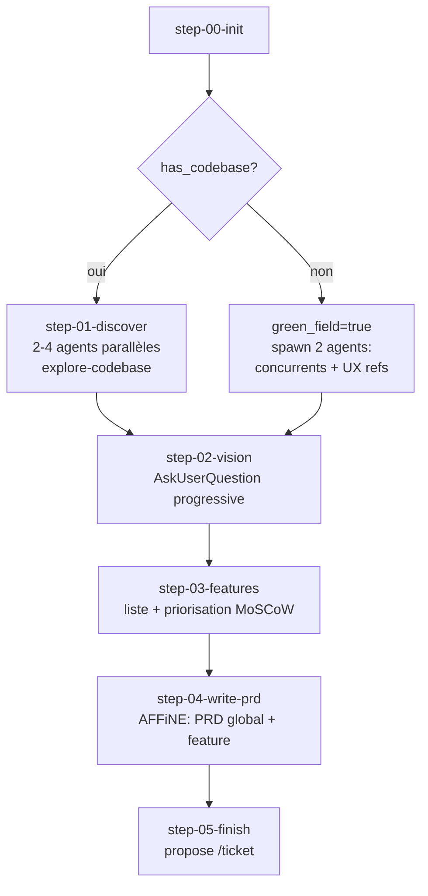
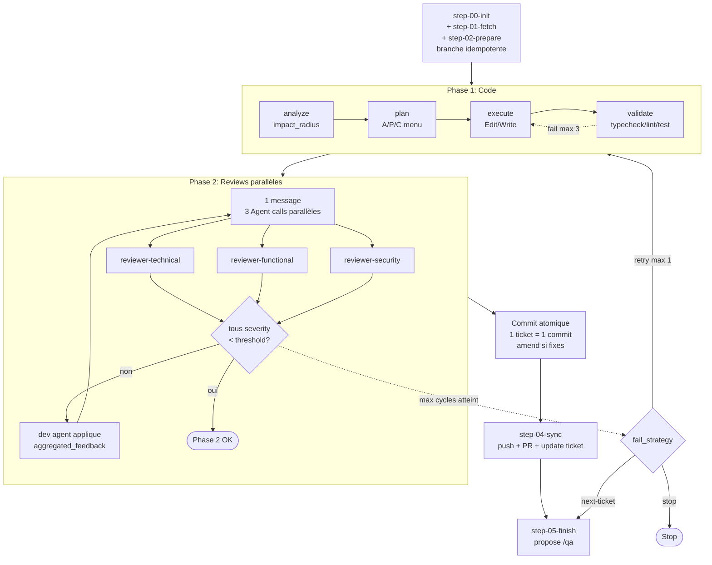
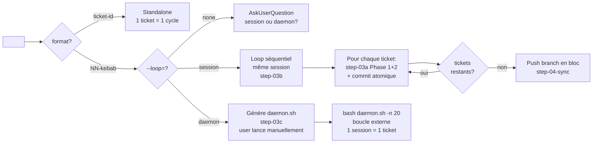
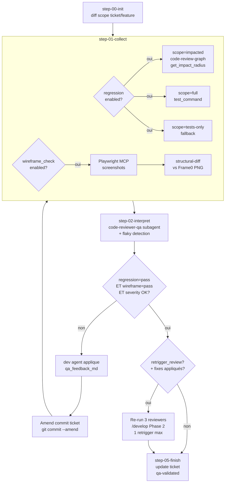
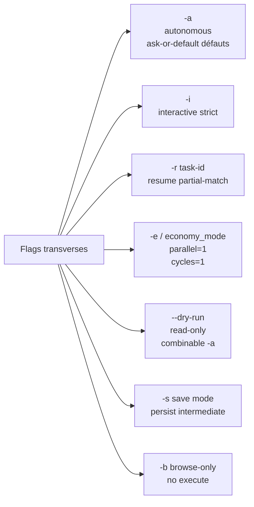
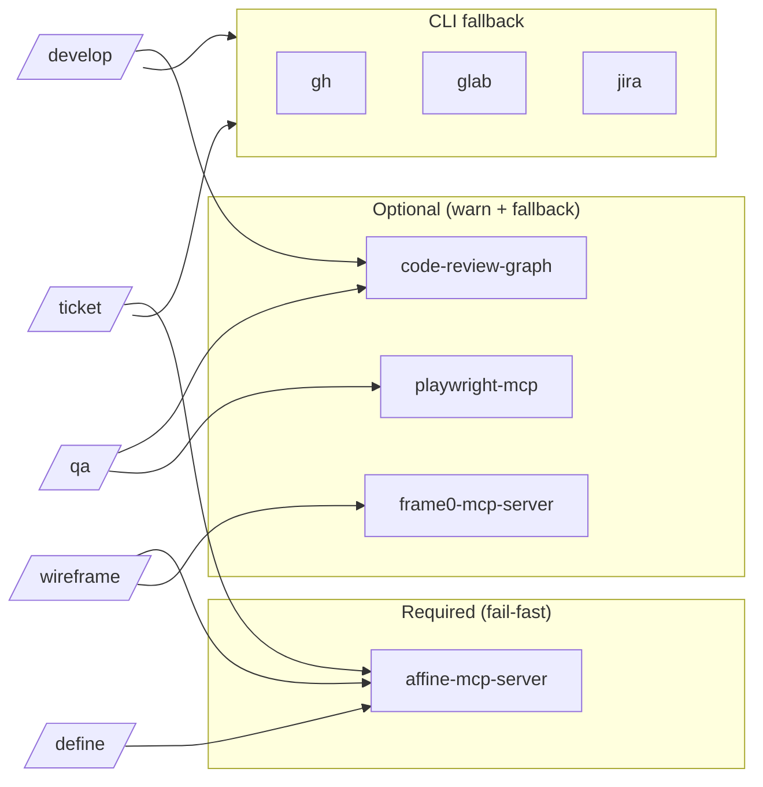
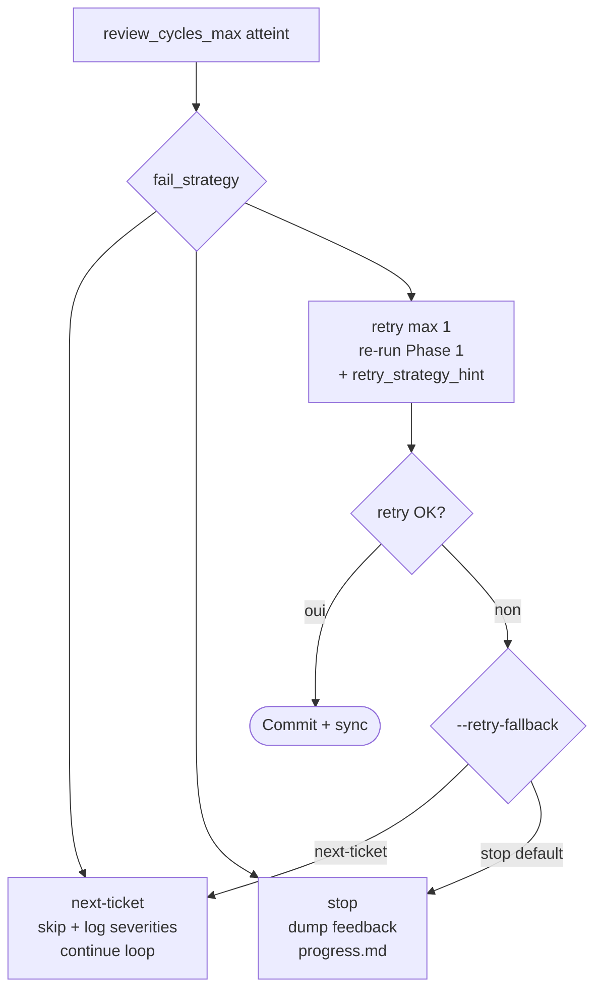

# Diagrammes workflow

Schémas visuels Mermaid. Vue globale + zooms par skill + variantes.

## 1. Vue globale (chaîne 5 skills)



## 2. Storage & sources de vérité



## 3. `/define` — flux interactif



## 4. `/develop` standalone — 2 phases + cycle review



## 5. `/develop` modes loop (3 variantes)



## 6. `/qa` — cycle régression + wireframe + retrigger



## 7. États feature (machine à états)

```mermaid
stateDiagram-v2
    [*] --> defined: /define
    defined --> ticketed: /ticket
    ticketed --> wireframed: /wireframe (UI feature)
    ticketed --> developed: /develop (no UI)
    wireframed --> developed: /develop
    developed --> qa-validated: /qa
    qa-validated --> [*]: ship

    defined --> defined: /define -r (resume)
    ticketed --> ticketed: /ticket -r
    wireframed --> wireframed: /wireframe -r
    developed --> developed: /develop -r
```

## 8. Mode flags matrix



## 9. MCP dependencies graph



## 10. Fail strategies (`/develop`)


