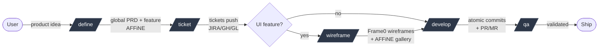
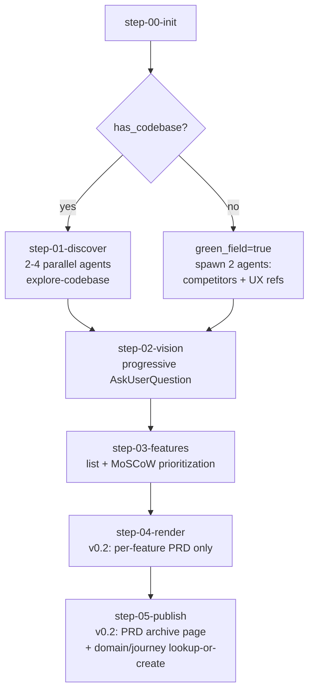
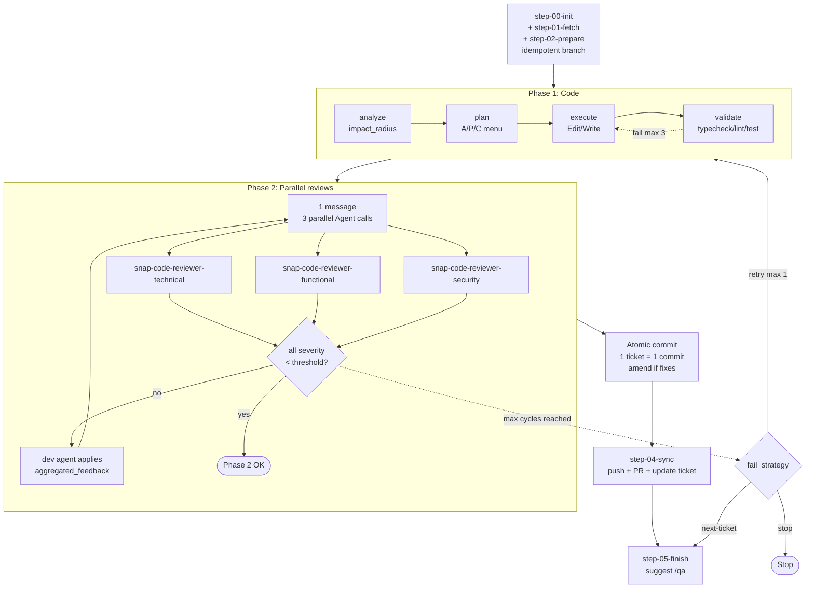
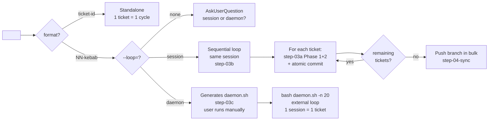
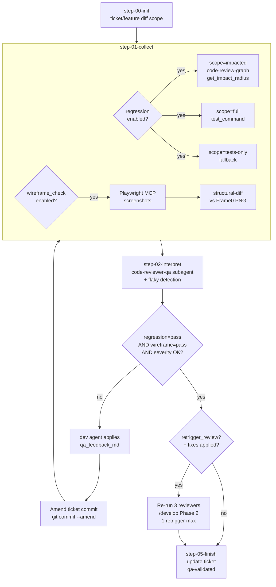
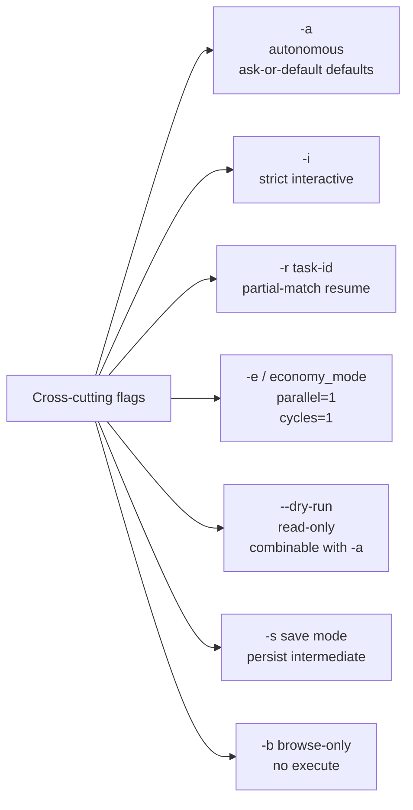
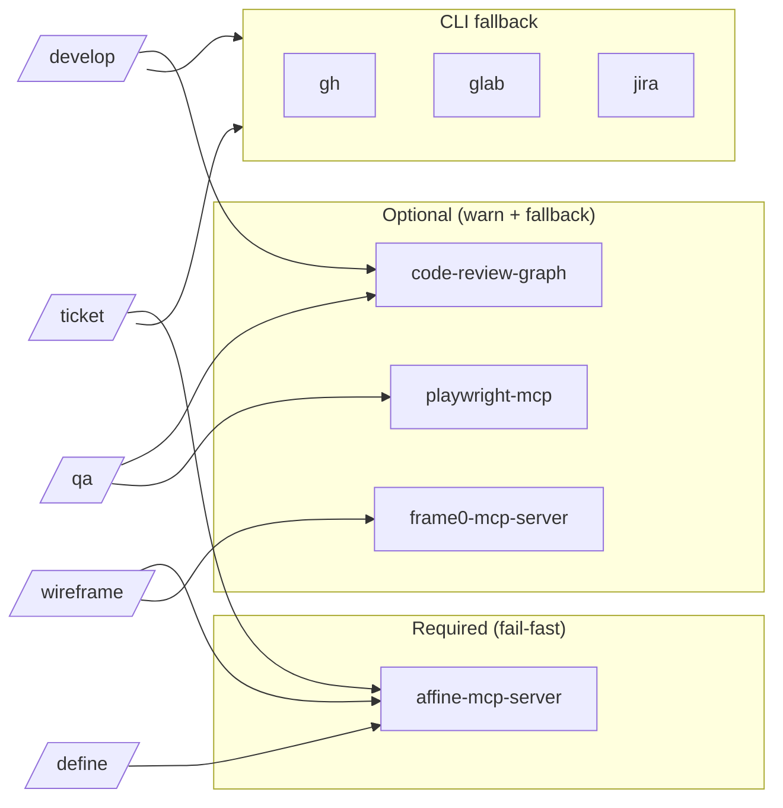
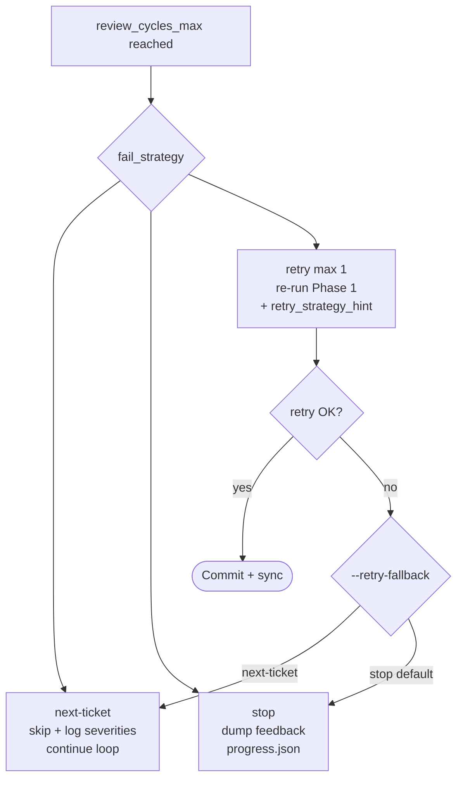

# Workflow diagrams

Visual Mermaid diagrams. Global view + per-skill zooms + variants.

## 1. Global view (5-skill chain)



## 2. Storage & sources of truth

```mermaid
flowchart TB
    subgraph LOCAL[".snap/ (local cache)"]
        IDX[index.md]
        FEAT[features/NN-slug/]
        FEAT --> META[manifest.json]
        FEAT --> TIX[tickets.json]
        FEAT --> PROG[progress.json]
        FEAT --> WIRES[wireframes/]
    end

    subgraph EXT["Sources of truth (external)"]
        AFFINE[(AFFiNE / Notion<br/>v0.2: PRD archive + Functional doc<br/>{domain}/{journey})]
        PLAT[(Tickets platform<br/>JIRA/GH/GL)]
        FRAME[(Frame0<br/>shapes + PNG)]
        GIT[(Git repo<br/>branches + commits)]
    end

    META -.prd.page_id.-> AFFINE
    TIX -.platform IDs.-> PLAT
    WIRES -.frame0_page_id.-> FRAME
    META -.branch_name.-> GIT
```

## 3. `/define` — interactive flow



## 4. `/develop` standalone — 2 phases + review cycle



## 5. `/develop` loop modes (3 variants)



## 6. `/qa` — regression + wireframe + retrigger cycle



## 7. Feature states (state machine)

```mermaid
stateDiagram-v2
    [*] --> defined: /define
    defined --> ticketed: /ticket
    ticketed --> wireframed: /wireframe (UI feature)
    ticketed --> developed: /develop (no UI)
    wireframed --> developed: /develop
    developed --> qa-validated: /qa
    qa-validated --> [*]: ship

    defined --> defined: /define -r (resume)
    ticketed --> ticketed: /ticket -r
    wireframed --> wireframed: /wireframe -r
    developed --> developed: /develop -r
```

## 8. Mode flags matrix



## 9. MCP dependencies graph



## 10. Fail strategies (`/develop`)


